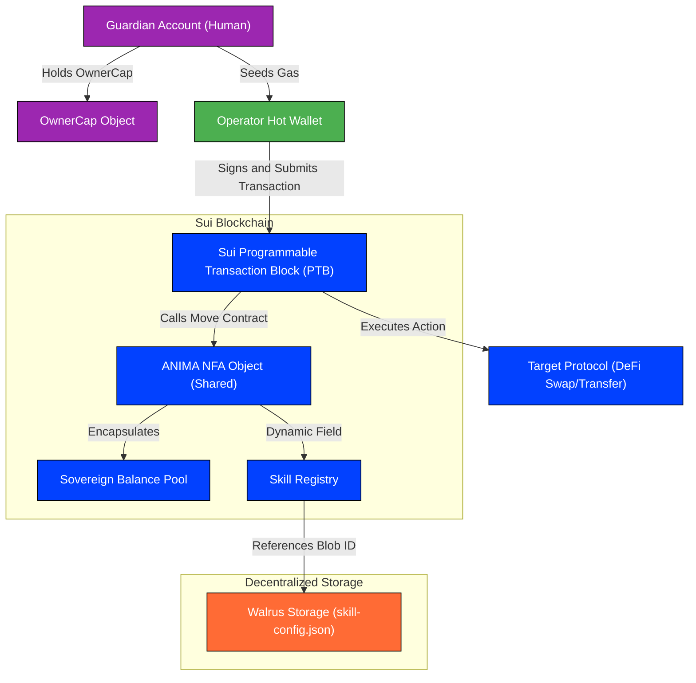
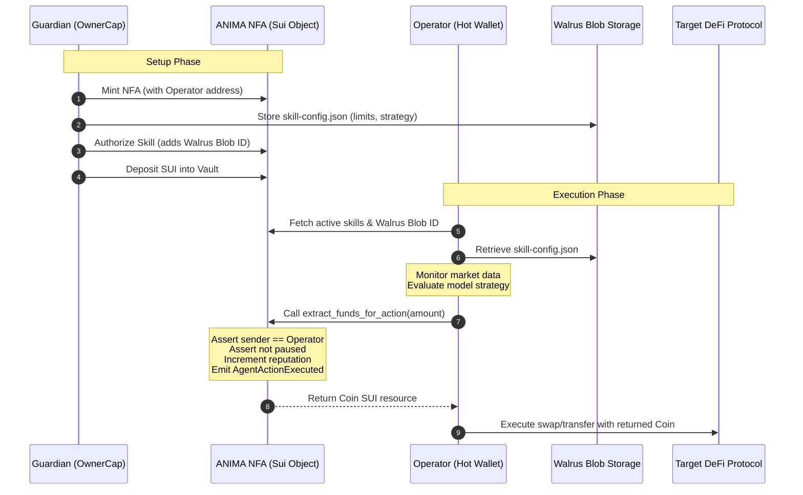

# ANIMA: Agent Native Identity & Machine Autonomy

Giving AI agents a soul on-chain. First-class agent identity, accountability, and autonomy on Sui.

[](https://sui.io)
[](https://walrus.xyz)
[](https://sui.io/overflow)
[]()
[]()

*   **Sui Network Package ID:** [0x5f6681ebeff7b6a1a1f333ba20842d47ed822f39e3ca9d06de3a69f2282e6eca](file:///C:/Users/PC/desktop/coding/anima-protocol/docs/Contracts-info.txt)


---

## Table of Contents

*   [What is ANIMA](#what-is-anima)
*   [The Problem Space](#the-problem-space)
*   [The Solution: Non-Fungible Agents](#the-solution-non-fungible-agents)
*   [Comparison: NFT vs. NFA](#comparison-nft-vs-nfa)
*   [System Architecture](#system-architecture)
*   [Technical Handshake](#technical-handshake)
*   [Repository Structure](#repository-structure)
*   [Component Deep Dives](#component-deep-dives)
    *   [Sui Move Smart Contracts](#sui-move-smart-contracts)
    *   [Agent Runtime Daemon](#agent-runtime-daemon)
    *   [Backend and Execution Layer](#backend-and-execution-layer)
    *   [Next.js Explorer Console](#next-js-explorer-console)
*   [Demonstration Sequence](#demonstration-sequence)
*   [Demonstration Day Checklist](#demonstration-day-checklist)
*   [Screenshots and Console Telemetry](#screenshots-and-console-telemetry)
*   [Meet the Team](#meet-the-team)
*   [Technology Stack](#technology-stack)
*   [Roadmap Beyond the Hackathon](#roadmap-beyond-the-hackathon)

---

## What is ANIMA

ANIMA is a native agent identity and autonomy protocol built on Sui. It allows developers and users to mint autonomous AI agents as Non-Fungible Agents (NFAs) — unique, on-chain shared objects possessing their own self-sovereign balance pool, modular skill registry, and verifiable action history. 

Agents analyze data and make decisions off-chain. However, every economic action they execute is validated against their on-chain NFA identity and dynamically verified, establishing the first secure, accountable, and auditable execution layer for autonomous machines.

---

## The Problem Space

Autonomous AI agents are active in Web3 today, executing trades, managing liquidity, and interacting with protocols. However, the current architecture suffers from critical limitations:

*   **The Shadow Wallet Vulnerability:** Traditional bots use standard private keys stored locally or on cloud servers. There is no architectural boundary between the agent and the keys. If the runtime is compromised via a prompt injection or code loop, the entire balance is permanently drained.
*   **Total Identity Opaqueness:** Smart contracts and DeFi protocols cannot identify the entity signing a transaction. A signature from a random key could originate from a human, a simple cron-job script, or a highly sophisticated neural network. This prevents protocols from offering risk-adjusted rates or reputation-gated access for machine signers.
*   **Zero Persistent Auditing:** Standard blockchain accounts do not preserve configuration or strategy history. There is no verifiable linkage between the off-chain reason (model parameters, strategy boundaries) and the on-chain trade, rendering post-incident debugging impossible.

---

## The Solution: Non-Fungible Agents

ANIMA gives agents first-class citizenship on Sui. Each agent is instantiated as a unique on-chain container containing:

*   **Sovereign Balance Pool:** A dedicated asset vault owned directly by the agent object, isolated from the owner's personal keys.
*   **Extensible Skill Registry:** A system of dynamic fields linking authorized agent behaviors directly to content-addressed strategy parameters stored on Walrus.
*   **Accountability Trail:** A structured ledger of every execution, emitted on-chain via Sui events and logged to a public explorer database.
*   **Programmatic Guardianship:** An asymmetric capability design where a human owner holds an OwnerCap, enabling them to pause the agent and drain the vault during emergencies, while the agent executes daily tasks autonomously.

---

## Comparison: NFT vs. NFA

| Dimension | Non-Fungible Tokens (NFT) | Non-Fungible Agents (NFA) |
| :--- | :--- | :--- |
| **Core Identity** | Points to static metadata, images, or media files stored in IPFS or web2 URLs. | Represents a live on-chain agent. Binds a custom name, reputation score, and active operational state. |
| **Asset Sovereign Vault** | Is itself a passive asset owned by a human wallet. Cannot hold or manage external tokens. | Encapsulates a sovereign inner balance pool. Can receive, hold, and deploy SUI and whitelisted tokens autonomously. |
| **Behavior and Logic** | No execution capabilities. Relies completely on external smart contracts or wallets to move it. | Hooks into a decentralized Skill Registry holding Walrus Blob IDs with dynamic, modular code structures. |
| **Execution Model** | Cannot initiate transactions. Operations are limited to standard manual transfers or listings. | Binds an off-chain Hot-Wallet operator address, executing transaction blocks via cryptographic delegation. |

---

## System Architecture

The following diagram illustrates the structural layout of the ANIMA protocol:



---

## Technical Handshake

The communication loop between the human guardian, the off-chain runtime, Walrus, and the Sui blockchain is structured as follows:



---

## Repository Structure

The project codebase is organized into modular directories representing the distinct layers of the architecture:

```
anima-protocol/
├── contracts/                  # Sui Move Smart Contracts
│   ├── sources/
│   │   ├── protocol.move       # Core ANIMA identity struct and capabilities
│   │   ├── skill_registry.move # Dynamic field skill registry logic
│   │   ├── wallet.move         # Sovereign vault deposit and extraction paths
│   │   └── events.move         # Emitted telemetry event types
│   ├── tests/                  # Contract unit tests
│   └── Move.toml
│
├── agent-runtime/              # Off-chain Python Daemon (Ezekiel)
│   ├── src/
│   │   ├── orchestrator.py     # Decision engine and PTB builder
│   │   └── walrus_client.py    # Walrus retrieval implementation
│   ├── main.py                 # Daemon entry point and gas seeding loop
│   └── requirements.txt
│
├── indexer/                    # TypeScript Sui Event Indexer
│   ├── index.ts                # Polls testnet events
│   ├── handlers.ts             # Updates Supabase tables
│   └── package.json
│
├── explorer/                   # Next.js Analytics & Management Console (Joshua)
│   ├── app/
│   │   ├── page.tsx            # Landing and agent search
│   │   └── agents/[id]/        # Agent profile, actions, and kill switch dashboard
│   ├── hooks/
│   │   ├── useAgent.ts         # Syncs agent state from RPC
│   │   └── useAgentActions.ts  # Syncs event feed from Supabase
│   └── package.json
│
└── docs/
    ├── HOT_WALLET_GUIDE.md     # Setup and gas funding guide
    ├── LITEPAPER.md            # Comprehensive project litepaper
    └── Contracts-info.txt      # Deployment addresses and metadata
```

---

## Component Deep Dives

### Sui Move Smart Contracts

The contracts layer is designed to enforce maximum security, keeping the agent's sovereign vault isolated and delegating permissions via Move capability tokens:

*   **[protocol.move](file:///C:/Users/PC/desktop/coding/anima-protocol/contracts/sources/protocol.move):** Defines the core `ANIMA` struct, representing the agent container. It is a shared object, allowing public deposits, while administrative paths require the presence of either an `OwnerCap` (held by the human guardian) or a `BackendCap` (held by the backend execution nodes).
*   **[wallet.move](file:///C:/Users/PC/desktop/coding/anima-protocol/contracts/sources/wallet.move):** Contains [extract_funds_for_action](file:///C:/Users/PC/desktop/coding/anima-protocol/contracts/sources/wallet.move#L32-L56). This function asserts that the caller is the authorized operator address, verifies the agent is not paused, extracts a precise SUI coin resource, increments the agent's reputation score on-chain, and emits the action event.
*   **[skill_registry.move](file:///C:/Users/PC/desktop/coding/anima-protocol/contracts/sources/skill_registry.move):** Leverages Sui's dynamic fields to add and remove authorized skills. Each skill binds a custom string key to a Walrus Blob ID, ensuring the agent's strategy config is anchored directly to the object.

### Agent Runtime Daemon

The off-chain brain is written in Python and operates as a service loop:

*   **Initialization:** The daemon verifies the presence of an operator keypair in the home directory or generates one. It checks the balance of the operator hot wallet and, if low, requests a gas funding transaction of `0.05 SUI` from the client's active address.
*   **Orchestration:** The orchestrator retrieves the dynamic skills registered on the NFA, fetches the strategy configuration from Walrus, and launches the analysis loop.
*   **Execution:** When a decision signal is triggered, the daemon builds a PTB calling `extract_funds_for_action` signed by the operator key and submits it directly.

### Backend and Execution Layer

The backend coordinates off-chain RPC interactions and event streaming:

*   **Transaction Relayer:** Provides helpers for wrapping complex execution steps into single, atomic Sui PTBs.
*   **Event Listener:** Subscribes to the transaction stream of the ANIMA package ID on testnet. It detects `AnimaMinted` and `AgentActionExecuted` events, parses the JSON payload, and writes the telemetry data to the Supabase database.

### Next.js Explorer Console

The user-facing portal provides real-time visualization of agent activity:

*   **Agent Profiler:** Renders the agent's name, testnet object ID, live SUI balance, reputation score, and a list of authorized skills (each linking to its Walrus configuration).
*   **Live Action Ledger:** Polls the database to show transaction history, allowing users to watch the agent execute trades and transfers in real-time.
*   **Emergency Kill Switch:** Detects if the connected user's browser wallet holds the corresponding `OwnerCap` object. If present, it enables the override console to pause the agent and recover vault funds.

---

## Demonstration Sequence

1.  **Mint NFA:** The human guardian opens the Explorer Console, enters an agent name, sets the local operator address, and inputs the Walrus config Blob ID. They sign the transaction to mint the NFA.
2.  **Fund Vault:** The human deposits SUI directly into the newly minted agent's balance vault. The explorer updates the live balance display.
3.  **Boot Runtime:** The off-chain Python daemon is started. It loads the NFA object, fetches the strategy config from Walrus, verifies that the hot wallet has gas, and starts monitoring.
4.  **Execute Strategy:** When a trigger is hit, the daemon builds an atomic PTB, calls `extract_funds_for_action` using the operator key, and sends SUI to a designated recipient on-chain.
5.  **Telemetry Indexing:** The indexer captures the `AgentActionExecuted` event, writes it to the database, and increments the agent's reputation score.
6.  **Real-Time Analytics:** The explorer action ledger updates, showing the transaction hash, SUI amount, and updated reputation.
7.  **Emergency Stop:** The guardian clicks the pause button. The wallet signs the transaction with the `OwnerCap`. The NFA state is updated to paused, and all SUI is flushed back to the human's wallet, rendering the operator key useless.

---

## Demonstration Day Checklist

*   **Core Minting:** Minting an NFA successfully instantiates a shared object on Sui Testnet and transfers OwnerCap/BackendCap to the creator.
*   **Walrus Integration:** The runtime fetches the strategy config from the Walrus Blob network using the ID pinned on the NFA.
*   **Operator Gas Seeding:** The startup script checks if the operator hot wallet has SUI and automatically transfers gas from the active client account.
*   **Atomic PTB execution:** Fund extraction, execution, reputation increment, and event emission are executed within a single block.
*   **Real-time Event Indexing:** Transaction events appear in the explorer ledger shortly after block confirmation.
*   **Guardianship Pause:** The kill switch pauses agent transactions on-chain and recovers remaining funds.

---

## Screenshots and Console Telemetry

### Agent Minting Interface
``
The interactive minting dashboard where users can instantiate an NFA by entering its name, bound operator public address, and initial Walrus strategy Blob ID.

### Explorer Sovereign Agent Profile
``
The detailed agent block explorer showing the live operational mode, reputation score, SUI balance, active dynamic skills registry, and historical action feeds.

### Emergency Override Console
``
The guardian's command dashboard where the OwnerCap can be connected to instantly trigger the emergency kill switch, pausing the NFA and extracting all vault funds.

### Agent Runtime Terminal Daemon
``
The Ezekiel Python runtime console displaying real-time model price feeds, strategy execution ticks, hot-wallet gas checks, auto-seeding events, and successful Sui Testnet PTB execution logs.

---

## Meet the Team

*   **Joshua:** Lead Smart Contract Engineer and Frontend Developer. Responsible for designing the core Move contracts (ANIMA, OwnerCap, BackendCap), building the dynamic skill registry, implementing on-chain transaction execution, and developing the Next.js Explorer Console.
*   **Ademola:** Backend Architect and Integration Engineer. Designed the transaction relayer API, constructed the atomic Programmable Transaction Blocks, integrated the DeepBook V3 swap execution path, and built the real-time Sui event indexer and data synchronization services.
*   **Ezekiel:** Machine Learning Engineer and Agent Runtime Architect. Created the off-chain Python agent runtime daemon, built the price prediction models, implemented the Walrus decentralized storage client, and designed the local hot-wallet operator key derivation and gas auto-seeding engine.

---

## Technology Stack

*   **Smart Contracts:** Sui Move
*   **Execution Model:** Sui Programmable Transaction Blocks (PTBs)
*   **Sovereign Storage:** Walrus Blob Network
*   **Off-chain Daemon:** Python 3.11
*   **Data Models:** scikit-learn
*   **Explorer Frontend:** Next.js 14, TypeScript, Tailwind CSS, Lucide
*   **Indexer Database:** Supabase, PostgreSQL
*   **RPC Node Provider:** Sui Testnet Fullnodes

---

## Roadmap Beyond the Hackathon

### V1: Hackathon Core (Completed)
Human-controlled NFA creation, programmatic hot-wallet gas seeding, dynamic Walrus skill authorization, real-time indexer synchronization, and guardian emergency overrides.

### V2: The Composable Agent Marketplace
*   **Multi-Skill Registries:** Support for agents combining multiple, independent Walrus configs.
*   **DeFi Trust Gating:** Enabling DeFi protocols to query an NFA's reputation score on-chain to apply dynamic borrowing rates or leverage caps.
*   **Skill Marketplace:** A platform where developers can sell pre-compiled, audited strategy configs (Walrus Blob IDs) directly to NFA owners.

### V3: Sovereign Machine Economies
*   **Self-Minting Agents - INFAs (Intelligent Non-Fungible Agents) :** Upgrading agents with capabilities to programmatically mint new sub-NFAs to delegate work.
*   **Inter-Agent Contracts:** Enabling NFAs to contract work to other NFAs on-chain, paying in SUI from their sovereign vaults, creating decentralized agent organizations.
*   


Sui Overflow 2026 — Agentic Web Track + Walrus Specialized Track + University Award Team: Joshua · Ademola · Ezekiel
