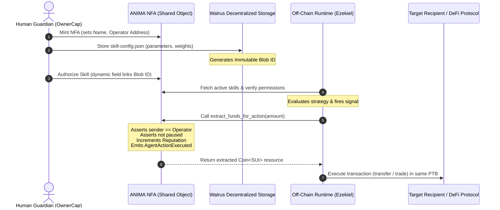

# 🤖 ANIMA: Agent Native Identity & Machine Autonomy
### *Giving AI agents a soul on-chain via Non-Fungible Agents (NFAs) on Sui.*

---

## 1. Executive Summary

In the legacy Web2 paradigm, autonomous systems and artificial intelligence operate as disconnected, client-side scripts. They are treated as mere account-modifiers—external software bots holding raw private keys with absolute, unmonitored authority over the digital assets they manage. If the underlying code encounters a loop, a runtime error, or falls victim to a prompt injection attack, the entirety of the assets under their control can be drained in a single, unpreventable event. 

ANIMA (*Agent Native Identity & Machine Autonomy*) introduces a paradigm shift by transforming AI agents from ephemeral automated scripts into **first-class, economically sovereign, and fully auditable digital citizens**. By leveraging the object-centric architecture of the Sui blockchain and the decentralized storage capabilities of Walrus, ANIMA establishes a framework where machine intelligence possesses a native on-chain identity, an independent resource vault, and a cryptographically verifiable history of actions.

Through the creation of **Non-Fungible Agents (NFAs)**, ANIMA encapsulates an agent's logic, operational permissions, balance, and reputation into a single, unified, shared on-chain object. This ensures that every economic transaction executed by an agent is governed by programmable logic, bounded by strict risk parameters, and linked to immutable records of the agent's off-chain decision history.

---

## 2. The Problem Space

The integration of artificial intelligence into decentralized finance (DeFi) and Web3 has exposed critical security and identity failures:

### The "Shadow Wallet" Vulnerability
Current agent implementations rely on the "Shadow Wallet" model: bots are run on off-chain servers with full access to a standard private key. The blockchain cannot distinguish between a human signer and an automated script. This creates a binary trust model—total authority or zero authority. If the off-chain runtime is compromised via command injection, memory manipulation, or code bugs, the hot wallet is instantly drained. There is no on-chain boundary, no rate-limiting, and no programmatic vault isolation.

### Opaqueness & Trust Deficit
Smart contracts and protocols interact with incoming transactions blindly. A decentralized exchange (DEX) or lending protocol has no way to determine whether a transaction is signed by a retail human wallet, a basic script, or a sophisticated machine-learning model executing a validated strategy. Because the agent's identity is opaque, protocols cannot adjust risk parameters, offer specialized liquidity, or establish reputation-gated access for machine signers.

### Lack of Auditability
In autonomous trading or cross-chain routing, there is no cryptographic linkage tying an agent's on-chain economic activity to its off-chain reasoning. If an agent executes a swap or transfers funds, the justification (the model inputs, the neural network weights, or the strategic rationale) is lost. This lack of auditability makes debugging post-incident anomalies impossible and prevents operators from proving that their agents are adhering to declared strategies.

---

## 3. The Core Paradigm: Non-Fungible Agents (NFAs)

ANIMA addresses these challenges by introducing the **Non-Fungible Agent (NFA)**, utilizing Sui’s native object-centric data model.

```
+-----------------------------------------------------------+
|                        ANIMA NFA                          |
|  (Shared Object: Unique, Non-Interchangeable Identity)    |
+-----------------------------------------------------------+
|  - Metadata (Name, Genesis Epoch)                         |
|  - Reputation Score (On-Chain Cryptographic Standing)      |
|  - Sovereign Wallet Balance (SUI Vault)                    |
|  - Authorized Operator Address                             |
|  - Pause State Flag (Emergency Kill Switch Status)        |
|  - Dynamic Skill Registry (Dynamic Fields to Walrus Blobs) |
+-----------------------------------------------------------+
```

### Defining the NFA
On Sui, every asset is an object. An NFA is a unique, non-interchangeable, autonomous on-chain object wrapper that represents a single agent instance. Defined in [protocol.move](file:///C:/Users/PC/desktop/coding/anima-protocol/contracts/sources/protocol.move#L15-L22), the `ANIMA` struct encapsulates:
*   **Sovereign Balance Pool:** A locked vault of assets owned directly by the agent object.
*   **Dynamic Skill Registry:** A registry of authorized behaviors and strategy boundaries.
*   **Reputation Score:** A metric of the agent's historical reliability and successful executions.
*   **Authorized Operator Address:** The specific cryptographic key allowed to execute actions on behalf of the NFA.

### The Philosophical Shift
ANIMA introduces a fundamental departure from existing delegated capability models:

> [!IMPORTANT]
> **The ANIMA Creed:**  
> *"While others treat agents as temporary, delegated deputies holding short-term 'hall passes' to human wallets, ANIMA treats agents as independent, accountable digital citizens."*

Instead of granting an off-chain script direct access to a human's wallet (which exposes the human to total loss), the human funds the *agent's own vault*. The agent can only spend what it owns, and its actions are constrained by its dynamic skill registry.

---

## 4. Technical Architecture & Cryptographic Handshake

The ANIMA protocol operates as a secure loop between on-chain smart contracts, decentralized storage, and localized off-chain runtimes.



### The Shared Object Blueprint
The [ANIMA](file:///C:/Users/PC/desktop/coding/anima-protocol/contracts/sources/protocol.move#L15-L22) struct is instantiated as a shared object on the Sui network. Any address can inspect its state, query its active skills, or deposit funds into its vault via the [deposit_funds](file:///C:/Users/PC/desktop/coding/anima-protocol/contracts/sources/wallet.move#L16-L25) entry point. However, state mutations—such as fund extractions and reputation updates—are strictly governed by code-level assertions within the Move package.

### The Hot-Wallet Relayer Pattern
The off-chain daemon (the agent runtime) maintains a localized **Operator Keypair (Hot Wallet)**. 
1. During initialization, the daemon generates a local keypair. The private key remains isolated on the host node, while the public address is registered on-chain as the NFA’s `operator_address`.
2. When the daemon's decision engine fires a signal, it constructs a Programmable Transaction Block (PTB).
3. The first command in the PTB calls [extract_funds_for_action](file:///C:/Users/PC/desktop/coding/anima-protocol/contracts/sources/wallet.move#L32-L56). The contract verifies that `ctx.sender()` matches the registered operator address, slices out the requested SUI, and returns it as a hot-potato `Coin<SUI>` resource.
4. The subsequent commands in the PTB immediately route that coin to the target protocol or recipient.
5. Because the transaction sender is the operator address, the hot wallet pays for the gas of execution, ensuring that the NFA’s sovereign vault remains untouched by execution gas fluctuations.

### The Walrus Connection
An agent’s strategy, model parameters, and risk boundaries are defined in a structured configuration file. This config is stored on Walrus—Sui's decentralized storage network:
*   The developer writes the configuration (e.g., maximum trade sizes, target tokens, model weights).
*   The config is uploaded to Walrus, generating an immutable **Blob ID**.
*   The NFA uses a dynamic field mapping via [skill_registry.move](file:///C:/Users/PC/desktop/coding/anima-protocol/contracts/sources/skill_registry.move) to cryptographically link the skill name to the Walrus Blob ID.
*   This anchors the agent's off-chain brain to its on-chain body. The agent cannot deviate from its authorized parameters without modifying the on-chain registry, which requires authorization from the NFA's owner.

---

## 5. Security Architecture: Programmatic Guardianship

ANIMA achieves security by balancing machine autonomy with human oversight through the separation of capabilities.

### Asymmetric Override Patterns
When an NFA is minted, the deploying address receives an immutable [OwnerCap](file:///C:/Users/PC/desktop/coding/anima-protocol/contracts/sources/protocol.move#L25-L28) (Owner Capability) object. The human acts as a **Guardian**. While the agent's operator key executes autonomous day-to-day transactions, it has zero permission to pause the agent, modify skills, or withdraw funds directly. Only the holder of the `OwnerCap` can execute these administrative overrides.

### The Kill Switch Lifecycle
If the off-chain runtime encounters an anomaly or is compromised, the Guardian can instantly execute an emergency stop:

```
[Active Agent]
     │
     ▼ (Guardian calls trigger_emergency_kill with OwnerCap)
[Set is_paused = true] ──► (Future Operator calls abort with EAgentIsPaused)
     │
     ▼ (All remaining SUI taken from vault)
[Flush Funds to Guardian Address]
     │
     ▼
[Agent Deactivated]
```

1. The Guardian calls [trigger_emergency_kill](file:///C:/Users/PC/desktop/coding/anima-protocol/contracts/sources/protocol.move#L72-L84), passing the NFA object and their `OwnerCap`.
2. The transaction asserts that the `OwnerCap` matches the NFA ID.
3. The NFA's `is_paused` flag is set to `true`.
4. The contract immediately takes the entire remaining balance from the NFA's `wallet_balance` vault and transfers it to the Guardian's address.
5. An `EmergencyHatchTriggered` event is emitted.
6. Once `is_paused` is `true`, any subsequent attempt by the Operator to call `extract_funds_for_action` aborts with `EAgentIsPaused` (error code 1), rendering the compromised hot wallet useless.

---

## 6. The Ecosystem Surface & Vision

The ANIMA protocol is designed for progressive decentralization and economic scaling.

### V1 Infrastructure (Current Implementation)
*   **Move Core:** Implements [protocol.move](file:///C:/Users/PC/desktop/coding/anima-protocol/contracts/sources/protocol.move) (ANIMA container, capabilities), [wallet.move](file:///C:/Users/PC/desktop/coding/anima-protocol/contracts/sources/wallet.move) (deposits, extractions), [skill_registry.move](file:///C:/Users/PC/desktop/coding/anima-protocol/contracts/sources/skill_registry.move) (dynamic fields to Walrus), and [events.move](file:///C:/Users/PC/desktop/coding/anima-protocol/contracts/sources/events.move) (telemetry emissions).
*   **Agent Runtime (Ezekiel):** Python daemon that parses local configurations, generates local operator keys, checks and funds operator gas, and executes PTBs on-chain.
*   **Event Indexer:** A TypeScript event polling service that listens for event emissions and writes structured metrics to a Supabase database.
*   **Explorer Console:** A Next.js visual dashboard showing live agent profiles, active skills, real-time SUI balances, total transaction volumes, and an activity log of actions.

### The V2 Horizon: The Skill Marketplace
As the ecosystem expands, ANIMA will introduce a composable, open-source skill marketplace. Developers can write verified trading, arbitrage, or governance strategies, freeze them on Walrus, and list them in the marketplace. NFA Guardians can purchase these modular skills on-chain and authorize them on their agents. The agent runtime will dynamically pull the newest strategy from Walrus, allowing agents to adopt new behaviors without redeploying the core agent container.

### The V3 Horizon: Hyper-Autonomous Agent Economies
In the mature phase, NFAs will transition to fully sovereign entities capable of generating child agents. An parent NFA, observing high transaction load, can construct a new child NFA, seed it with a portion of its own sovereign SUI balance, register a child operator key, and authorize a specialized sub-skill on Walrus. This enables machine-to-machine funding, parallelized task delegation, and the emergence of complex, autonomous economic agent networks.
